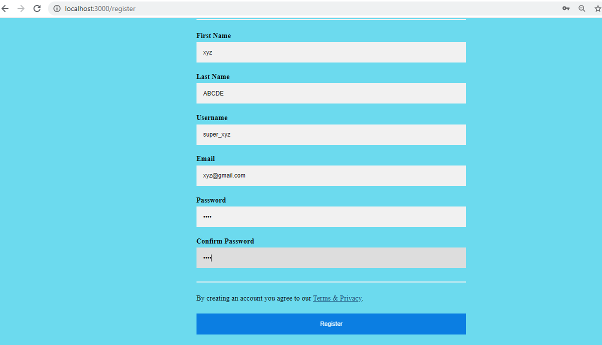

# chat_web_app
A one to one text messaging system using MERN stack and socket.io

After downloading above files,
go to 'server' folder then open 'nodemon.json'
In variable named **'MONGO_ATLAS_PW'**, paste your Mongo ATLAS PASSWORD which you get on MongoDB website

Refer tutorial - https://www.mongodb.com/blog/post/quick-start-nodejs-mongodb--how-to-get-connected-to-your-database

**Now in folder 'database', edit connect.js file as follows-**

At this string ,replace the '<password>' part
mongodb+srv://<username>:<password>@<your-cluster-url>/test?retryWrites=true&w=majority
=> const url='mongodb+srv://<username>:'+process.env.MONGO_ATLAS_PW+'@<your-cluster-url>/test?retryWrites=true&w=majority'

